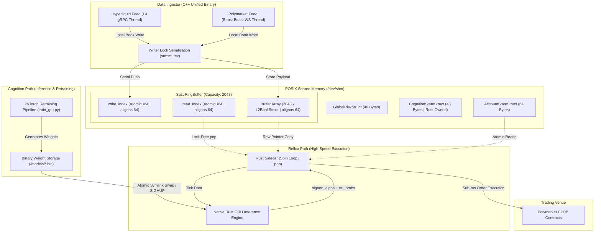

# Poly8 Capital: Polymarket & Hyperliquid HFT Arbitrage Pipeline

[](LICENSE)
[]()
[]()
[]()

This repository contains the high-fidelity, production-grade **Polymarket High-Frequency Trading (HFT) Arbitrage and Market-Making Pipeline**. The system processes real-time microstructural order book data from **Hyperliquid** (L2/L4 perp feeds) to predict and execute directional and arbitrage trades on **Polymarket** binary option events (specifically BTC and ETH 5-minute and 15-minute "Up or Down" contracts).

---

## 1. System Vision & Performance Targets

Designed to scale to at least **$20,000 USD in weekly execution revenue**, the pipeline is engineered for extreme low latency and hard deterministic safety:
*   **Photon-to-Strategy Latency Budget**: Sub-**50 microseconds** end-to-end processing from Hyperliquid network packet arrival to POSIX Shared Memory (SHM) writing.
*   **Inference Latency Budget**: Sub-**10 microseconds** CPU execution for the native Rust 2-layer, 128-hidden-unit **Dual-Head GRU Inference Engine** (representing 2.56M MAC operations).
*   **Infrastructure Hygiene**: Zero reliance on public Polygon node RPCs. All Ethereum/Polygon interactions are managed via high-fidelity WebSocket channels leveraging premium dedicated endpoints (e.g., QuickNode, Infura) inside isolated execution contexts.

---

## 2. System Architecture: Reflex vs. Cognition

The pipeline implements a decoupled **"Reflex vs. Cognition"** architectural pattern. High-frequency network ingestion and hot-path execution are kept isolated from cold-path offline retraining and analytical engines.



### Architectural Sub-Components

1.  **C++ Unified Ingestor (`unified_ingestor`)**:
    *   Coordinated multi-threaded binary using four dedicated threads:
        *   **Thread 1 (`L4BookManager`)**: Connects to the Hyperliquid L4 gRPC book events, processes signals instantly, and updates local memory.
        *   **Thread 2 (`PolymarketBridge`)**: A lightweight `boost::beast` async WebSocket client that feeds live Polymarket order book updates.
        *   **Thread 3 (`AccountSync`)**: A 1Hz loop using JSON-RPC queries to fetch balance states and exposure from ERC-20 contract configurations on Polygon.
        *   **Thread 4 (`MarketDiscovery`)**: Queries the Polymarket Gamma APIs every 30 seconds to fetch newly created 5-minute and 15-minute contracts, pushing hot addresses back to Thread 2.
    *   **Lock-Free `MicrostructureEngine`**: Embedded within the gRPC thread to compute real-time micro-alphas (Order Flow Imbalance [OFI], EWMA-smoothed execution flow $dV/dt$, and self-exciting Hawkes process intensity kernels) directly inside the ingestion context before SHM serialization.
2.  **POSIX Shared Memory (`/dev/shm`) & SPSC Ring Buffer**:
    *   A cache-aligned **SPSC (Single Producer, Single Consumer) Lock-Free Ring Buffer** (Capacity: `2048`) acts as the zero-copy datapath between C++ and Rust.
    *   CPU false sharing is eliminated via strict `alignas(64)` boundaries on read/write pointers and the buffer data.
    *   **Producer-Side Serialization**: To resolve multi-producer conflicts (gRPC, WebSocket, and status threads), ingestion threads serialize access to a local master struct using a lightweight `std::mutex` before pushing to the lock-free ring buffer.
    *   **Strict Backpressure & Drop Policy**: If the queue fills up, packets are immediately discarded, and `dropped_count` is incremented. This prevents network latency accumulation (queue bloat).
    *   **Layout Alignment**: C++ relaxed atomics (`std::atomic::store` / `load`) align exactly with Rust pointer bitwise pop copies (`std::ptr::read`) to ensure binary layout integrity.
3.  **Rust Hot-Path Executor (`rust_executor`)**:
    *   Busy-spins lock-free on the consumer side of the SPSC buffer.
    *   **Dual-Head GRU Inference**: Executes the forward-pass math (using optimized native Rust linear, layer-norm, and cell state kernels). It inputs a 15-feature microstructure vector and outputs:
        *   `signed_alpha`: Volatility-capped directional pricing offset.
        *   `nu_probs`: Softmax probability distribution mapping current regime classifications (Contrarian, Herding, Neutral).
    *   **Options-Calibrated Pricing Formula (`calculate_base_p_theo`)**: Synthesizes the final trading probability by combining the spot price deviation with GRU alpha, rolling phase lag tracking, $\nu$-regime sensitivity scaling, and longshot premium penalties at extremes ($< 0.10$ or $> 0.90$).
    *   **Sub-millisecond Execution**: Directly submits signing orders to Polymarket V2 CLOB API. It writes model probabilities back to the secondary sequence-locked SHM segment `/dev/shm/hl_cognition_<asset>` for analytics.
4.  **PyTorch Training & Harvester (Cold-Path)**:
    *   `historical_bulk_harvester.py` streams data from both the market book and cognition SHM segments, writing synchronized ticks and computed features into `.parquet` archives.
    *   `train_gru.py` retrains model weights offline every 6 hours using walk-forward validation and regime-weighted sampling. Updated binary models are dynamically hot-swapped by the Rust executor on `SIGHUP` or every 1000 ticks.

---

## 3. Directory Layout & Key Modules

Note: Scripts & docs are stripped from this online repo for privacy reasons. Please reach out for info on the logic. Defi-agents folders contain Status Update & Notes to read through the progression of the project from start to finish.

```text
├── defi-agents/                       # Python Sentinel & Documentation Layer
│   ├── ChangeLog.md                   # Chronological release log
│   ├── status_updates/                # Engineering status reports
│   └── polymarket/                    # Main Polymarket strategy directory
│       ├── .env                       # Core runtime configuration (git-ignored)
│       ├── requirements.txt           # Python package dependencies
│       ├── train_gru.py               # PyTorch GRU training pipeline
│       ├── historical_bulk_harvester.py # Telemetry parquet logging client
│       ├── check_pipeline_health.sh   # Asset health validation script
│       ├── models/                    # Binary weight models (BTC/ETH)
│       ├── src/                       # Source codes
│       │   ├── hft_tapreader/         # C++ Ingestor codebase
│       │   │   ├── SpscRingBuffer.hpp # Custom C++ SPSC Lock-Free Queue
│       │   │   ├── TapReader.cpp      # gRPC Hyperliquid interface
│       │   │   └── PolymarketBridge.cpp # Boost.Beast WebSocket client
│       │   └── rust_executor/         # Low-latency execution core
│       │       ├── src/main.rs        # Strategy loop & subscription spin core
│       │       ├── src/shm.rs         # Match C++ Ring Buffer layout in Rust
│       │       ├── src/strategy.rs    # Dual-Head GRU inference & options pricing
│       │       └── config_btc.toml    # Asset execution parameters
│       └── tests/                     # Validation suite
│           ├── test_shm_alignment.py  # Binary parity validator
│           └── test_c_edge_cases.py   # Spikes and edge-case parser tests
├── docs/                              # System documentation
│   ├── CODEBASE_OVERVIEW_Update_20260609.md # System Reference doc (v4.0.0)
│   ├── telemetry.md                   # Detailed telemetry specifications
│   └── eng-design/                    # Engineering planning & designs
└── scripts/                           # Production orchestration scripts
    ├── bootstrap_production.sh        # Master entry point (Compilation & Launch)
    ├── hft_start_system.sh            # Cluster launcher
    ├── unified_pipeline_supervisor.sh # Self-healing process supervisor
    ├── launch_isolated_pipeline.sh    # Low-level isolated process launcher
    ├── safe_complete_shutdown.sh      # Emergency stop & SHM purge script
    └── setup_ci_dependencies.sh       # Workstation bootstrap script
```
---

## 4. Bare-Metal Low-Latency System Tuning (Deployment Prerequisites)

To guarantee sub-50μs latency bounds, the host node (recommended: AWS `c7i.metal-24xl` or bare metal with 96 vCPUs running Ubuntu 26.04) must be tuned to eliminate kernel scheduler jitter and packet latency. Run the system alignment scripts as root.

### Step 1: Precision Time Synchronization
To prevent clock drift on trade execution, configure `chrony` to track stratum-1 time sources:
```bash
# Handled automatically via configure_hft_node.sh
sudo systemctl restart chrony
chronyc tracking
```

### Step 2: Core Isolation & Kernel Parameter Mapping
Edit `/etc/default/grub` to isolate the CPU cores dedicated to the hot-path busy-spin loops (cores 44-47 and 92-95 on standard 96-core topologies). Add these kernel flags:
```text
GRUB_CMDLINE_LINUX_DEFAULT="quiet splash isolcpus=domain,44-47,92-95 nohz_full=44-47,92-95 rcu_nocbs=44-47,92-95 processor.max_cstate=1 intel_idle.max_cstate=0 amd_idle.max_cstate=0 mitigations=off transparent_hugepage=never"
```
Rebuild the boot config and restart the server:
```bash
sudo update-grub
sudo reboot
```

### Step 3: Network Pipeline Acceleration
Optimize socket buffer limits, queue allocations, and enable BBR congestion control inside `/etc/sysctl.d/99-hft-low-latency.conf`:
```text
net.core.default_qdisc = fq
net.ipv4.tcp_congestion_control = bbr
net.ipv4.tcp_slow_start_after_idle = 0
net.ipv4.tcp_fastopen = 3
net.core.rmem_max = 16777216
net.core.wmem_max = 16777216
vm.swappiness = 0
```
Apply parameters using `sudo sysctl --system`.

### Step 4: Local DNS Caching
Set up local caching in `/etc/dnsmasq.conf` to avoid downstream DNS latency spikes during WebSocket connections:
```text
listen-address=127.0.0.1
cache-size=10000
dns-forward-max=150
```
Restart `dnsmasq`: `sudo systemctl restart dnsmasq`.

### Step 5: CPU Scaling & NIC Interrupt Evacuation
Nuke `irqbalance` to prevent network interrupt allocation changes at runtime. Bind network card queues away from isolated strategy cores (e.g. mapping them to management cores 0-3):
```bash
sudo systemctl disable --now irqbalance
# Initialize runtime config
sudo /usr/local/bin/hft-runtime-init.sh
```

---

## 5. Compilation & Installation

Verify the toolchain and install all library dependencies before compiling the binaries.

### 1. Install System Dependencies
Execute the CI script to install Boost, gRPC, Protobuf, curl, openssl, CMake, and build utilities:
```bash
sudo ./scripts/setup_ci_dependencies.sh
```

### 2. Set Up Python Virtual Environment
Initialize the environment inside the `polymarket` strategy subdirectory:
```bash
cd defi-agents/polymarket
python3 -m venv .venv
source .venv/bin/activate
pip install -r requirements.txt
```

### 3. Rebuild C++ Unified Ingestor
Compile the ingestion binary:
```bash
cd src/hft_tapreader
mkdir -p build && cd build
cmake ..
make -j$(nproc)
```

### 4. Build Rust Executor
Compile the Rust executor using the release profile:
```bash
cd ../rust_executor
cargo build --release
```

---

## 6. Runtime Configuration & Environment Setup

Create and populate the `.env` file under `defi-agents/polymarket/`. Ensure all URLs point to **premium node provider endpoints** (e.g. QuickNode, Infura) and not public RPCs.

### Environment Variable Template (`.env`)
```bash
# Core Polygon RPC & WebSockets (Premium URL Required)
GAS_ORACLE_RPC_URL=https://<YOUR_PREMIUM_RPC_URL>/
POLYGON_RPC_URL=https://<YOUR_PREMIUM_RPC_URL>/
POLYGON_WSS_URL=wss://<YOUR_PREMIUM_WSS_URL>/

# Polymarket API Credentials
POLY_API_KEY=<YOUR_POLY_API_KEY>
POLY_API_SECRET=<YOUR_POLY_API_SECRET>
POLY_WALLET_ADDRESS=<YOUR_POLY_WALLET_ADDRESS>
POLY_PROXY_WALLET=<YOUR_POLY_PROXY_WALLET>
POLY_WALLET_PKEY=<YOUR_POLY_WALLET_PRIVATE_KEY>
POLY_SECRET=<YOUR_POLY_SECRET_PRIVATE_KEY>
POLY_SIGNATURE_TYPE=2 # 2 = GnosisSafe, 0 = EOA, 1 = Proxy, 3 = Poly1271
POLY_CLOB_API_URL=https://clob.polymarket.com

# Hyperliquid Ingestion Target
HYPERLIQUID_GRPC_TARGET=<YOUR_HYPERLIQUID_PREMIUM_GRPC_ENDPOINT>

# Observability Channels
SLACK_WEBHOOK_URL=https://hooks.slack.com/services/YOUR/ALERTS/WEBHOOK
SLACK_WEBHOOK_URL_PERFS=https://hooks.slack.com/services/YOUR/PERFS/WEBHOOK
SLACK_WEBHOOK_URL_PORTFOLIO=https://hooks.slack.com/services/YOUR/PORTFOLIO/WEBHOOK

# Execution Flags
INITIAL_COLLATERAL=1000.0
LIVE_MODE=true
EXECUTOR_CORE=94
```

---

## 7. Production Orchestration

The execution layer must be operated using the production orchestration scripts in the `scripts/` directory.

### 1. Bootstrap the Entire Cluster
The master script handles file cleanup, directory permissions, binary compilation, binary-alignment tests, database reconciliation, cluster spin-up, and health verification:
```bash
./scripts/bootstrap_production.sh btc eth
```

### 2. Manual System Startup
To launch the background supervisors manually for a specified set of assets:
```bash
./scripts/hft_start_system.sh btc eth
```

### 3. Graceful Shutdown
To trigger a clean termination of all active executors, ingestors, process monitors, and safely wipe the POSIX Shared Memory segments:
```bash
./scripts/safe_complete_shutdown.sh
```

---

## 8. Verification & Test Suites

Before deploying live capital, run the test verification suite to ensure mathematical calibration and binary parity:

```bash
# 1. C++ GTest Suite
# Checks FIFO queue behavior, backpressure drop logic, and thread concurrency
cd defi-agents/polymarket/src/hft_tapreader/build
./tests/run_tests

# 2. Rust Executor Verification
# Checks unit math, Kelly scaling, and loads the active GRU binary weights
cd defi-agents/polymarket/src/rust_executor
cargo test

# 3. Python Integration Checks
# Checks memory-mapped binary alignment layouts across C++ and Rust
cd defi-agents/polymarket
source .venv/bin/activate
export PYTHONPATH=.
python3 tests/test_shm_alignment.py
python3 tests/test_c_edge_cases.py
python3 tests/test_pusd_readiness.py
```

---

## 9. Telemetry & Ephemeral Storage Infrastructure

Data generated by the pipeline is isolated into three distinct tiers to optimize I/O paths:
1.  **Transactional Database (SQLite)**:
    *   Path: `defi-agents/polymarket/persistence.db`
    *   Maintained by the Rust Hot-Path executor to record durable transaction states (`Trades_Log`) and enforce system limit structures (`Risk_Limits`).
2.  **Ephemereal State & Pub/Sub (Redis)**:
    *   Uses a local Redis database (`redis://127.0.0.1/`) to broadcast real-time metrics and state indicators.
    *   *Hash Map*: `market:{asset}:metrics` caches active `signed_alpha` and `nu_probs`.
    *   *Pub/Sub Topic*: `events:weight_reload` notifies the executor to reload binary weights, while `events:staleness` handles alert broadcasts.
3.  **Analytical Data Engine (Parquet & DuckDB)**:
    *   `historical_bulk_harvester.py` saves real-time ticks into partitioned Parquet files under `data/realtime/{asset}/`.
    *   Used by the quantitative team to run walk-forward cross-validations, check for training fallacies, and evaluate performance anomalies.

---

## 10. Pre-Flight Live Checklist

Before enabling live execution with a target weekly scale of $20,000 USD, check that:
*   [ ] **Secrets**: Ensure `.env` is populated with active private keys and premium RPC URLs.
*   [ ] **Weights**: Verify that the weights symlink `gru_weights_{asset}_latest.bin` exists under `models/` and that the executor log confirms: `GRU weights successfully loaded`.
*   [ ] **Latency**: Run `monitor_performance.py` and verify hot path latencies are below 50μs.
*   [ ] **Direct Connection**: Confirm the node is deployed in the AWS Ireland region (`eu-west-1`) to enable direct, low-latency routes to Polymarket's V2 CLOB (bypassing custom VPN tunnels).
*   [ ] **Slack Channels**: Verify performance heartbeats and risk limits are routing correctly to your Slack webhooks.
