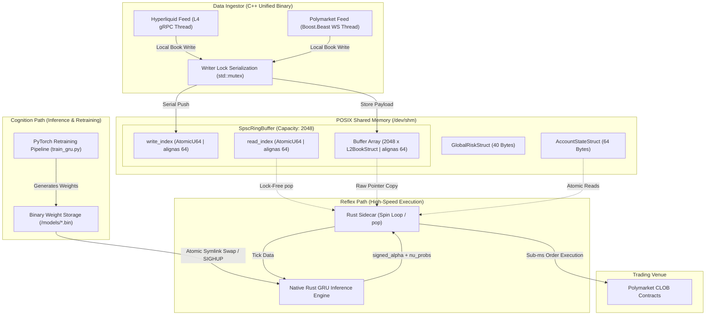

# Polymarket & Hyperliquid HFT Pipeline Codebase Overview

**UPDATED:** 2026-06-09 19:30:00 UTC  
**VERSION:** 4.0.0 (Dual-Head GRU Inference Integration)

This document serves as the high-fidelity codebase and architecture reference for the Polymarket High-Frequency Trading (HFT) Arbitrage and Market-Making Pipeline. It captures the comprehensive June 2026 upgrade transitioning the system's "RNN-Equivalent" single-neuron pricing oracle to a fully trained, native Rust, 2-layer, 128-hidden-unit **Dual-Head GRU Inference Engine** integrated with empirical options pricing math and zero-downtime weight updates.

---

## 1. System Vision & Performance Targets

The objective of this trading engine is to execute high-speed arbitrage and directional prediction strategies on **Polymarket** binary option events (BTC and ETH 5-minute and 15-minute "Up or Down" contracts) leveraging microstructural predictive signals parsed in real-time from the **Hyperliquid** L2/L4 perp order books.

To remain profitable under highly competitive HFT conditions, the system is engineered to achieve:
*   **Latency Budget**: Sub-**50 microseconds** end-to-end processing from Hyperliquid network packet arrival to POSIX Shared Memory (SHM) writing; and sub-**10 microseconds** for the native GRU math forward-pass on CPU.
*   **Scale of Execution**: Designed to produce over **$20,000 USD** in weekly execution revenue.
*   **Infrastructure Hygiene**: Zero reliance on public Polygon node RPCs. All Ethereum/Polygon interactions are managed via high-fidelity WebSocket channels leveraging premium dedicated endpoints (e.g., QuickNode, Infura) inside isolated runtime spaces.

---

## 2. System Architecture: Reflex vs. Cognition

The codebase adheres to a hybrid **"Reflex vs. Cognition"** pattern. Slower, complex analytical computations are strictly decoupled from the deterministic, low-latency execution pathway.

### End-to-End Pipeline & Shared Memory Topology



### ASCII Schematic View (Optimized for Vim / Text Editors)

```text
                         +--------------------------------------+
                         | 1. DATA INGESTION (C++ Unified Ingest)|
                         |                                      |
                         |  [ gRPC HL Thread ]  [ WS Poly Th. ]  |
                         +-----------+                  +-------+
                                     |                  |
                                     v                  v
                               +------------------------------+
                               |     Local Master L2 Book     |
                               +--------------+---------------+
                                              |
                                              v std::lock_guard<std::mutex>
                               +------------------------------+
                               |     Writer Mutex Lock        |
                               +--------------+---------------+
                                              |
                                              | push()
                                              v
+-----------------------------------------------------------------------------+
|               2. ZERO-COPY POSIX SHARED MEMORY (/dev/shm)                    |
|                                                                             |
| +-------------------------------------------------------------------------+ |
| |                    SpscRingBuffer<L2BookStruct, 2048>                   | |
| |                                                                         | |
| |  [ write_index ]   ----> (Offset: 0B, AtomicU64, Cache aligned)          | |
| |                                                                         | |
| |  [ read_index ]    ----> (Offset: 64B, AtomicU64, Cache aligned)         | |
| |                                                                         | |
| |  [ Buffer Array ]  ----> (Offset: 128B, 2048 x L2BookStruct, Aligned)    | |
| |    Slot 0: [ hl_seq | poly_seq | bids | asks | signals ... ]            | |
| |    Slot 1: [ ... ]                                                      | |
| |                                                                         | |
| |  [ dropped_count ] ----> (Offset: 2.36MB, AtomicU64, Cache aligned)      | |
| +------------------------------------+------------------------------------+ |
|                                      |                                      |
|                                      | Lock-Free pop()                      |
|                                      v                                      |
| +------------------------------------+------------------------------------+ |
| | AccountStateStruct (64 Bytes)      | GlobalRiskStruct (40 Bytes)        | |
| | - pUSD balance, Nonces, Exposure   | - Drawdown limit check fields      | |
| +------------------------------------+------------------------------------+ |
+--------------------------------------|--------------------------------------+
                                        |
                                        | pop() raw ptr copy (std::ptr::read)
                                        v
                      +-----------------------------------+
                      |    3. REFLEX HOT PATH (Rust)      |
                      |                                   |
                      |  [ Rust Executor (CPU Spin Loop) ]|
                      |  - Runs Native GRU Inference      |
                      |  - Updates PhaseLag & Regimes     |
                      +-----------------+-----------------+
                                        |
                                        | sub-ms execution
                                        v
                               +-------------------+
                               |   Trading Venue   |
                               |  Polymarket CLOB  |
                               +-------------------+
                                         ^
                                         | weight files
                                         |
                      +-----------------+-----------------+
                      |   4. COGNITION COLD PATH (Python) |
                      |                                   |
                      |  [ PyTorch Retrainer (train.py) ] |
                      |  - Ingests Parquet archives       |
                      |  - Retrains weights every 6 hours |
                      |  - Saves binary files to /models  |
                      +-----------------------------------+
```

### The Reflex Path (Hot Path)
*   **Ingestion (C++)**: Consumes gRPC feeds and WebSockets, performs fast micro-alpha computations, and pushes updates to `/dev/shm/hl_l2_book_<asset>` via a lock-free queue.
*   **Execution (Rust)**: Busy-spins on the consumer side of the lock-free `SpscRingBuffer`, polling for updates. If a signal threshold is crossed, it runs the native **2-Layer GRU Forward Pass** using the loaded model weights, updates the **PhaseLagTracker**, calculates the options-calibrated theoretical probability, and hits the Polymarket CLOB.

### The Cognition Path (Cold Path)
*   **Offline PyTorch Retraining**: The Cold Path retrains a Gated Recurrent Unit (GRU) model on historical Parquet data. It uses walk-forward cross-validation and regime-weighted sample training to prevent overfitting.
*   **Dynamic Weight Export**: Validated weights are exported to raw binary files under the `models/` directory, which are dynamically hot-swapped by the Rust executor on SIGHUP or every 1000 ticks.

---

## 3. C++ Unified Ingestor & L4 Microstructure Signal Processing

The ingestion layer operates as a unified, high-performance C++ multi-threaded binary (`unified_ingestor`). 

### A. C++ Ingestor Multi-Threaded Engine
The C++ binary coordinates four high-efficiency threads mapping distinct execution paths:
1.  **Thread 1 (`L4BookManager`)**: Subscribes to Hyperliquid L4 gRPC book events, processes microstructural signals instantly in-memory, and manages the localized sequence and SHM buffer writes.
2.  **Thread 2 (`PolymarketBridge`)**: A lightweight `boost::beast` asynchronous WebSocket client subscribing to active Polymarket order books, parsing frames using rapid JSON mechanisms and recording them to the SPSC structures.
3.  **Thread 3 (`AccountSync`)**: A 1Hz loop using a Web3 JSON-RPC library to query CTF contract states and pUSD balances on Polygon Mainnet.
4.  **Thread 4 (`MarketDiscovery`)**: Queries the Polymarket Gamma APIs every 30 seconds to fetch newly created 5m and 15m contracts, feeding hot address rotations back to Thread 2.

### B. L4 Microstructure Signal Processing
The gRPC ingestion thread embeds a custom, lock-free **`MicrostructureEngine`** that synthesizes real-time micro-alpha signals directly in the network ingestion context:
*   **Order Flow Imbalance (OFI)**: Calculates the net volume delta of active orders added, modified, or canceled at the best bid/ask levels.
*   **EWMA-Smoothed Execution Flow ($dV/dt$)**: Tracks the value-weighted execution speed and transaction velocity of crossed limit orders.
*   **Hawkes Process Intensity Kernels**: Models self-exciting order arrival rates to estimate localized intensity spikes, scaling down sizing during hyper-excited phases.

---

## 4. Inter-Process Communication: Lock-Free SPSC Ring Buffer

The system utilizes a cache-aligned **SPSC (Single Producer, Single Consumer) Lock-Free Ring Buffer** with capacity `2048`.

### Core IPC Layout & Alignment (`alignas(64)`)
To completely eliminate CPU false sharing, the `SpscRingBuffer` layout is strictly isolated:

```cpp
template <typename T, size_t Capacity = 2048>
struct alignas(64) SpscRingBuffer {
    alignas(64) std::atomic<uint64_t> write_index{0};
    alignas(64) std::atomic<uint64_t> read_index{0};
    alignas(64) T buffer[Capacity];
    alignas(64) std::atomic<uint64_t> dropped_count{0};
};
```

### Producer-Side Serialization (Writer Mutex)
To resolve multi-producer conflicts (gRPC thread, Polymarket WS thread, heartbeat thread) while maintaining SPSC invariants relative to the reader:
*   The writing threads coordinate through a lightweight `std::mutex` and `std::lock_guard` solely on the C++ writer threads to serialize updates to a local master struct.
*   The thread holding the lock pushes the serialized master struct to the ring buffer.
*   The Rust reader spins completely lock-free on the consumer end (`pop()`).

---

## 5. Strict Backpressure and Queue Drop Policy

To prevent latency accumulation (queue bloat) during extreme market spikes:
*   If the SPSC queue is full (`write_index - read_index == Capacity`), the C++ pusher **drops the packet immediately** rather than blocking.
*   An atomic `dropped_count` is incremented.
*   This ensures that networking threads never stall, keeping the stream fresh.

---

## 6. Binary Alignment & Memory-Layout Integrity

Since memory-mapped files map raw bytes directly across C++ and Rust, layouts must be 100% binary-compatible.

### A. Custom C++ Relaxed Copies for `L2BookStruct`
To copy atomic fields inside raw buffer structures:
```cpp
struct L2BookStruct {
    std::atomic<uint64_t> hl_sequence{0};
    std::atomic<uint64_t> poly_sequence{0};

    L2BookStruct(const L2BookStruct& other) {
        hl_sequence.store(other.hl_sequence.load(std::memory_order_relaxed), std::memory_order_relaxed);
        poly_sequence.store(other.poly_sequence.load(std::memory_order_relaxed), std::memory_order_relaxed);
    }
};
```

### B. Rust Alignment and Pointer Bitwise Pop Copies
In Rust (`src/rust_executor/src/shm.rs`), we match the C++ memory layout exactly, utilizing raw pointer loads (`std::ptr::read`) to copy atomic structures:
```rust
pub fn pop(&self) -> Option<L2BookStruct> {
    let r = self.read_index.load(Ordering::Acquire);
    let w = self.write_index.load(Ordering::Acquire);
    if r == w { return None; }
    
    let index = (r % CAPACITY) as usize;
    unsafe {
        let ptr = self.buffer.as_ptr().add(index);
        let item = std::ptr::read(ptr);
        self.read_index.store(r + 1, Ordering::Release);
        Some(item)
    }
}
```

---

## 7. Dual-Head GRU Inference Engine & Options Pricing Integration

The core strategy uses a native Rust neural network engine to estimate micro-adjustments and market regimes on every tick.

### A. Network Topology
The inference engine implements a 2-layer Gated Recurrent Unit (GRU) with a model dimension of `128` units. It accepts 15 standardized input features:
*   **Inputs**: `[ofi, signed_flow, path_delta, path_curvature, sigma_fast, approx_p, variance_scaler, phase_lag, nu_regime, pm_spread, bid_conc, ask_conc, sweep_cost, whale_imbalance, stale_flag]`
*   **Dual Output Heads**:
    1.  **Head 1 (`signed_alpha`)**: Directional pricing offset, clamped by asset-specific volatility caps (ETH: 10%, BTC: 15%).
    2.  **Head 2 (`nu_probs`)**: Probability distribution across 3 classes: contrarian, neutral, herding.

### B. Math Kernels
To maintain execution speeds below 10μs without adding external libraries, math layers are written in native Rust:
*   `linear`: General matrix-vector product ($Y = W X + B$)
*   `layer_norm`: Normalization across dimensions with scaling factors.
*   `gru_step`: GRU cell equations incorporating update ($z$), reset ($r$), and candidate ($n$) gates:
    $$h_t = (1 - z) \odot n + z \odot h_{t-1}$$
*   `sigmoid`, `fast_tanh`, and `softmax_3` activations.

### C. Options-Calibrated Pricing Formula (`calculate_base_p_theo`)
The theoretical price is derived by combining the spot price deviation with the GRU micro-adjustments and applying structural friction guards:
1.  **$p(1-p)$ Variance Anchor**: Replacing Black-Scholes time decay, a continuous liquidity anchor scales spot price differences relative to strike.
2.  **Phase Lag Mitigation**: Feed `signed_alpha` into a rolling `PhaseLagTracker`.
3.  **$\nu$-Regime Sensitivity**: The GRU predicted `nu_probs` scales pricing sensitivity (e.g. herding scales aggression down to 0.7x, contrarian scales aggression up to 1.3x).
4.  **Longshot Premium Penalty**: If $p_{theo}$ reaches extremes ($< 0.10$ or $> 0.90$), a spread penalty based on the live Polymarket order book is applied to prevent executing into wide market maker spreads.
5.  **Geometric Depth sweep discount**: Reduces theoretical edge by the sweep cost required to consume levels L2-L10, capped at 5 cents.

---

## 8. Directory Structure & Key Modules

```text
├── defi-agents/                       # Python Sentinel & Documentation Layer
│   ├── ChangeLog.md                   # Chronological release log (v2.30.0 active)
│   ├── Status Updates & Notes-...     # Daily engineering logs and notes
│   └── polymarket/                    # Main Polymarket strategy directory
│       ├── historical_bulk_harvester.py # Harvester capturing 15 features & L2 levels
│       ├── train_gru.py               # PyTorch GRU training pipeline
│       ├── models/                    # Binary weight models (BTC/ETH)
│       ├── src/                       # Rust and C++ source codes
│       │   ├── hft_tapreader/         # C++ Ingestor codebase
│       │   │   ├── SpscRingBuffer.hpp # Custom SPSC Lock-Free Ring Buffer
│       │   │   ├── TapReader.cpp      # gRPC Hyperliquid interface
│       │   │   └── PolymarketBridge.cpp # Boost.Beast WebSocket client
│       │   └── rust_executor/         # Low-latency execution core
│       │       ├── src/main.rs        # Strategy loop & subscription spin core
│       │       ├── src/shm.rs         # Match C++ Ring Buffer layout in Rust
│       │       └── src/strategy.rs    # Dual-Head GRU inference & options pricing
│       └── tests/                     # Multi-language verification tests
└── docs/                              # System documentation
    ├── CODEBASE_OVERVIEW.md           # Legacy codebase overview
    └── CODEBASE_OVERVIEW_Update_20260609.md # This updated GRU-based overview
```

---

## 9. Production Orchestration & Launcher Scripts

### A. Production Bootstrap Orchestrator (`bootstrap_production.sh` - v2.8.0)
*   **Initialization**: Configures environment variables from `.env` and initializes POSIX shared memory segments cleanly under `/dev/shm`.
*   **Compilation**: Triggers automated recompilation of the C++ ingestor and the Rust executor dynamically based on CPU core availability.
*   **Cluster Initiation**: Executes `hft_start_system.sh` to spin up supervisions.
*   **Health Verification**: Polls the shared memory segments for up to 60 seconds.

### B. Isolated Pipeline Launcher (`launch_isolated_pipeline.sh` - v2.8.0)
*   **Direct Ingestion**: Connects directly from Ireland to Polymarket's V2 CLOB and order matching engine, eliminating the need for VPN tunnels or custom network namespaces (`polymask`).
*   **Execution Structure**: Launches the C++ ingestor and the Rust executor directly as user worker processes.
*   **SHM Handshake**: Suspends execution and polls for active `shm_health_check.py` validation to ensure the shared memory ring buffer is responsive.

---

## 10. Verification, Test Suites, and Operational Health

The entire system's mathematical, architectural, and binary layout integrity is fully verified across the codebase:
1.  **C++ GTest Suite (`tests/run_tests`)**:
    *   `SpscRingBufferTest.BasicPushPop`: Confirms correct FIFO sequencing.
    *   `SpscRingBufferTest.BackpressureAndDrop`: Confirms packet discarding and `dropped_count` atomic incrementing on buffer exhaustion.
    *   `SpscRingBufferTest.ConcurrentStress`: Simulates 1,000,000 highly contested packet updates across threads.
2.  **Rust Test Suite (`cargo test`)**:
    *   `test_ring_buffer_layout`: Validates exact byte sizes, offsets, and alignment matching between Rust's SPSC queue representation and C++ schemas.
    *   `test_gru_loading_and_inference`: Loads the latest production weights file, runs a forward pass on mock features, checks that predicted values are valid, and verifies that Softmax-3 probabilities sum to 1.0. All 23 executor tests pass.
3.  **Python Test Suite (`pytest`)**:
    *   All tests pass successfully across strategy, network partitioning, boundary validations, and Slack reporters.

---

## 11. Next Steps and Live Deployment Checklist

Before enabling live execution with a target weekly scale of $20,000 USD, ensure the following steps are confirmed:
1.  **Premium RPC & WebSocket URLs**: Ensure `.env` is populated with premium Polygon WebSocket URLs.
2.  **Verify Weights Loading**: Verify that the symlink `gru_weights_{asset}_latest.bin` exists under `models/` and that the executor log confirms: `GRU weights successfully loaded`.
3.  **Direct Connection (Ireland)**: Ensure the server has a direct route to Polymarket's V2 CLOB and Hyperliquid gRPC endpoints (bypassing VPN/namespace).
